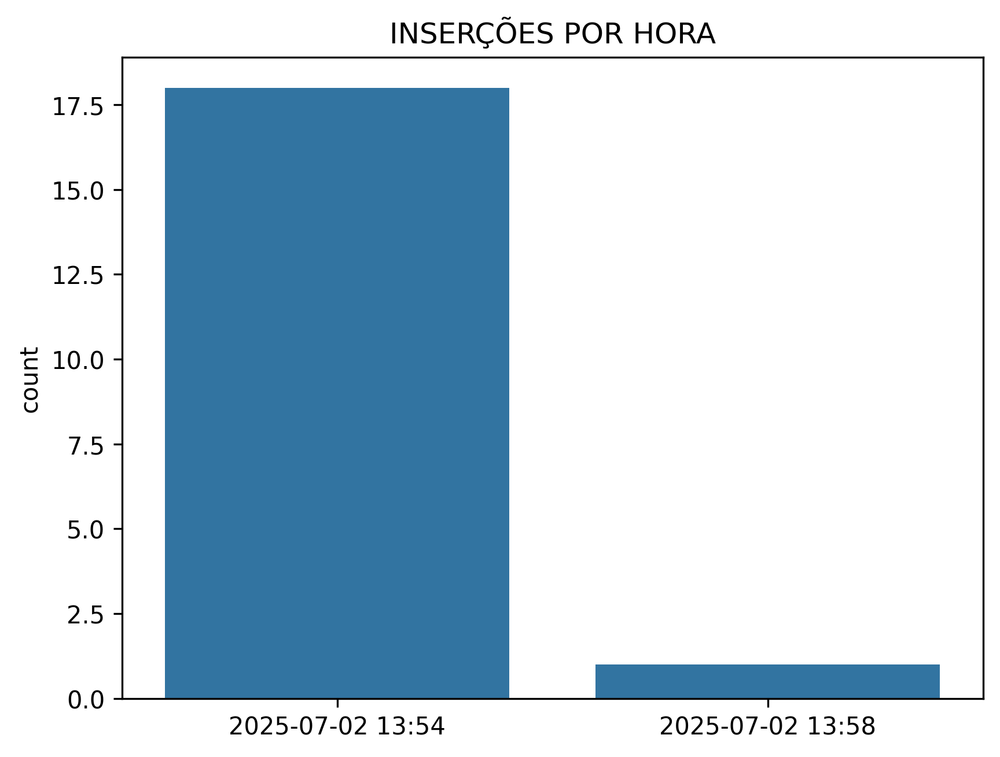

# RELATÓRIO ANÁLISE DE SEGURANÇA trabalho_dw (POSTGRESQL)

 ## USUÁRIOS ENCONTRADOS:

 ## SUPERUSUÁRIOS ENCONTRADOS:
Role           Superuser    Create Role    Create DB    Can Login
-------------  -----------  -------------  -----------  -----------
laura          True         True           True         True
administrador  True         False          False        True
postgres       True         True           True         True

 ## USUÁRIOS UTILIZANDO SENHA PADRÃO: 
- Usuário 'postgres' AUTENTICADO com senha 'senha'

 ## SCHEMAS ENCONTRADOS:
- pg_toast     
- pg_catalog     
- public     
- information_schema     

 ## PERMISSÕES DE CRIAÇÃO NO SCHEMA ENCONTRADAS:
- pg_catalog     
- public     
- information_schema     

 ## MONITORAMENTO DE INSERÇÕES

 