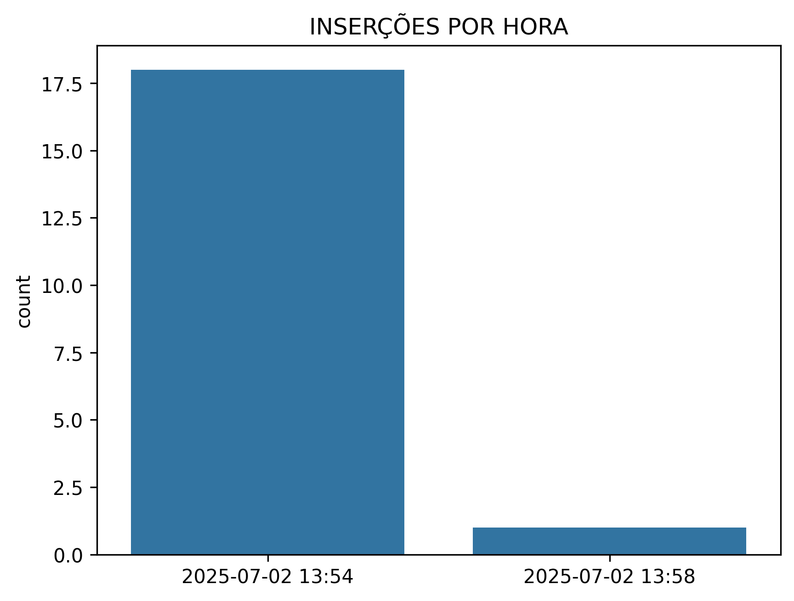
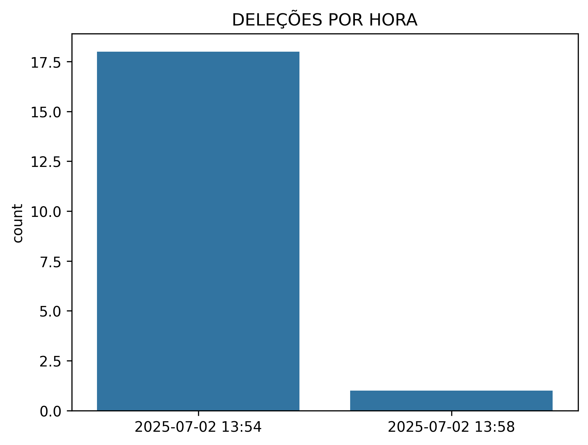

# RELATÓRIO ANÁLISE DE SEGURANÇA trabalho_dw (POSTGRESQL)

 ## USUÁRIOS ENCONTRADOS:
- pg_database_owner
- pg_read_all_data
- pg_write_all_data
- pg_monitor
- pg_read_all_settings
- pg_read_all_stats
- pg_stat_scan_tables
- pg_read_server_files
- pg_write_server_files
- pg_execute_server_program
- pg_signal_backend
- pg_checkpoint
- pg_use_reserved_connections
- pg_create_subscription
- laura
- administrador
- postgres

 ## SUPERUSUÁRIOS ENCONTRADOS:
| Role          | Superuser   | Create Role   | Create DB   | Can Login   |
|:--------------|:------------|:--------------|:------------|:------------|
| laura         | True        | True          | True        | True        |
| administrador | True        | False         | False       | True        |
| postgres      | True        | True          | True        | True        |

 ## USUÁRIOS UTILIZANDO SENHA PADRÃO: 
- :warning: Usuário 'postgres' AUTENTICADO com senha 'senha'

 ## SCHEMAS ENCONTRADOS:
- pg_toast     
- pg_catalog     
- public     
- information_schema     

 ## PERMISSÕES DE CRIAÇÃO NO SCHEMA ENCONTRADAS:
- pg_catalog     
- public     
- information_schema     

 ## MONITORAMENTO DE INSERÇÕES

 
 ## MONITORAMENTO DE DELEÇÕES

 